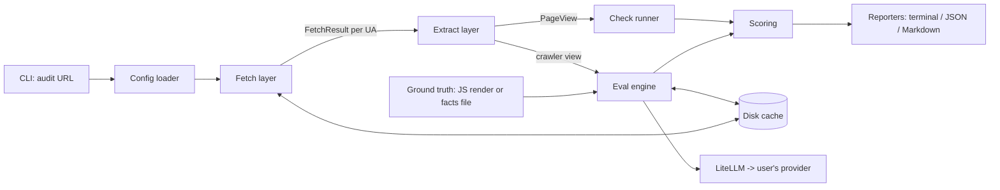

# Architecture

Part of the [geoprobe PRD](PRD.md). Working name; see PRD.

## 1. Principles

1. **Deterministic first.** Checks work with no API key. LLM features are an optional layer on top.
2. **Evidence over opinion.** Every finding carries the data that produced it.
3. **One result model, many reporters.** Terminal, JSON, and Markdown render the same Pydantic models.
4. **Reproducible.** Cache everything expensive; fix random and model settings.
5. **Safe by default.** SSRF protection, size limits, polite concurrency.

## 2. Tech stack

| Layer | Choice | Notes |
|---|---|---|
| Language | Python 3.10+ | Strongest ecosystem for fetch / extract / LLM evals |
| CLI | Typer + Rich | Typed commands, good help, nice reports |
| Models | Pydantic v2 | Config, results, JSON output |
| HTTP | httpx (async) | Per-bot user-agents, timeouts, concurrency |
| robots.txt | `urllib.robotparser` or Protego | Evaluate per-bot rules; pick after spike (see DECISIONS) |
| Main-content extraction | trafilatura | Approximates what a text-only crawler obtains |
| HTML parsing | selectolax or lxml | Headings, links, meta |
| Structured data | extruct | JSON-LD, microdata, OpenGraph |
| LLM access | LiteLLM | One interface for many providers, BYO keys |
| JS rendering | Playwright (optional extra) | Only for no-JS vs rendered comparison |
| Cache | diskcache (SQLite-backed) | LLM calls and fetches |
| Packaging | uv + `uv_build` | PyPI trusted publishing from GitHub Actions. `pyproject.toml` pins `uv_build>=0.12.23,<0.13.0` and the build was verified with `uv build`; an earlier draft of this table said hatchling, which was stale. |
| Quality | ruff, pyright (or mypy), pytest, respx, pre-commit | LLM cassettes for CI |
| Docs | mkdocs-material | |

Deliberately excluded from v0.1: Scrapy / Crawl4AI (too heavy), LangGraph (reserved for the v0.3 fix agent), any database server.

## 3. High-level data flow



## 4. Module layout

```
src/geoprobe/
  __init__.py
  cli.py                # Typer app, command wiring only
  config.py             # flags < env < toml merge; Pydantic Settings
  models.py             # Result models shared by everything
  fetch/
    client.py           # httpx wrapper, SSRF guard, limits
    bots.py             # data-driven bot registry (UA strings, tokens)
    robots.py           # robots.txt parsing and per-bot evaluation
    sitemap.py          # sitemap + index parsing, page sampling
    render.py           # optional Playwright fetch
  extract/
    content.py          # trafilatura wrapper -> markdown/text
    structure.py        # headings, meta, canonical, lang
    structured_data.py  # extruct wrapper, JSON-LD validation
    view.py             # builds PageView objects
  checks/
    base.py             # Check protocol + registry
    access.py           # ACC-*
    render.py           # REN-*
    structure.py        # STR-*
    schema.py           # SD-*
    discovery.py        # DIS-*
    trust.py            # TRU-*
    site.py             # SITE-*
  evals/
    questions.py        # question generation
    retrieval.py        # chunk -> embed -> top-k retrieve (see ADR-011)
    answer.py           # answer from crawler view only
    judge.py            # compare to ground truth
    runner.py           # trials, aggregation, variance
    cost.py             # token / cost estimation for --dry-run
  llm/
    client.py           # LiteLLM wrapper, retries, caching, usage accounting
  scoring.py            # weights -> category and overall scores
  report/
    terminal.py
    json.py
    markdown.py
  telemetry.py          # opt-in; see TELEMETRY.md
  cache.py
tests/
  fixtures/             # saved HTML, robots.txt, sitemaps, LLM cassettes
  checks/ evals/ fetch/ report/
```

## 5. Core interfaces

### 5.1 Fetch results

```python
class FetchResult(BaseModel):
    url: str
    final_url: str
    bot: str                    # "browser", "GPTBot", ...
    status: int | None
    headers: dict[str, str]
    body: bytes | None          # truncated at max_bytes
    elapsed_ms: int
    error: str | None
    blocked_by: Literal["robots", "waf", "challenge", "status", None]
```

### 5.2 PageView

A `PageView` is one page as seen through one lens (a bot UA, or a JS-rendered browser).

```python
class PageView(BaseModel):
    url: str
    lens: str                   # "browser-nojs", "GPTBot", "rendered"
    text: str                   # main content, markdown
    text_chars: int
    headings: list[Heading]
    meta: MetaInfo              # title, description, canonical, lang, robots meta
    structured_data: list[dict] # parsed JSON-LD items
```

### 5.3 Checks

```python
class Check(Protocol):
    id: str                     # "ACC-001"
    category: str
    weight: int
    def run(self, ctx: AuditContext) -> CheckResult: ...

class CheckResult(BaseModel):
    id: str
    status: Literal["pass", "warn", "fail", "skip", "error"]
    score: float                # 0..1 within the check's weight
    message: str
    evidence: dict[str, Any]
    fix: FixHint | None
```

Registration is explicit (a list in `checks/__init__.py`), not import-magic, so the catalog is easy to audit and test.

### 5.4 AuditContext

Holds the config, fetch results, page views, and a handle to the cache. Checks read from it and never fetch on their own, which keeps them pure and unit-testable with fixtures.

## 6. Fetching design

- **Bot registry** (`bots.py`) is data, not code: name, UA string, robots token, category (training / search / user-triggered / other), docs URL. Update without touching logic.
- **Parity comparison.** For each page, fetch as `browser` and as each bot, then compare status, size ratio, and extracted-text similarity. Large divergence suggests user-agent-based blocking or cloaking.
- **Challenge detection.** Heuristics for common bot-challenge pages (known markers in body/headers) so a "200 OK" challenge page isn't treated as content.
- **Concurrency.** Default 4 concurrent requests, per-host delay, jittered. Configurable.
- **Limits.** Per-request timeout, max redirects, max response bytes (default 5 MB), max pages.
- **SSRF guard.** Resolve and validate IPs before connecting (and on every redirect); reject private, loopback, link-local, and metadata ranges unless `--allow-private`.
- **Honest identification.** Simulated-bot requests add an `X-Geoprobe-Test: 1` header so site operators can recognize test traffic. The tool is intended for sites the user controls.

## 7. Extraction design

- The "crawler view" is deliberately a **no-JS HTML fetch** passed through main-content extraction. This is an approximation of a text-only crawler, and the docs say so.
- Extraction output is cached by `(url, lens, content hash)`.
- JSON-LD is parsed leniently, then validated against a small set of expected types per page role (home, article, product, FAQ) in SD checks.

## 8. Eval engine design

See [EVALS](EVALS.md) for method. Architecture notes:

- Eval takes two inputs per page: `crawler_view` and `ground_truth`. Both are `PageView`-like or facts-file derived.
- Stages are separate functions with pure inputs/outputs so each can be cached and tested independently: `generate_questions → answer → judge → aggregate`.
- LLM client wrapper handles retries with backoff, per-call timeouts, usage accounting, and writes every call to the cache keyed by `(model, params, prompt hash)`.
- Answerer and judge can use different models (recommended).
- Temperature is fixed (0 by default); where a provider supports a seed, it is passed.

## 9. Scoring

- Each check has a weight; check `score` is a fraction of its weight.
- Category score = sum(check points) / sum(check weights) for checks that ran (skips are excluded from the denominator).
- Overall deterministic score = weighted sum over all categories, 0–100.
- Eval produces a **separate** answerability score (0–100) with variance. It is reported next to the deterministic score, not blended into it, so users can see which signal moved.
- Policy-aware: a deliberate bot block is reported as `policy` evidence and handled per config rather than automatically failing.

## 10. Configuration precedence

`CLI flags` > `environment variables` > `geoprobe.toml` (project) > `~/.config/geoprobe/config.toml` (user) > defaults.

Secrets (API keys) come from environment variables or the OS keyring, never from `geoprobe.toml` committed to a repo (the tool warns if it finds one).

## 11. Error handling

- Network and parse failures become `error` or `skip` check results with a message, not crashes.
- Partial results are always reported. A failed fetch of one bot does not abort the audit.
- Typed exceptions map to exit codes defined in [CLI_SPEC](CLI_SPEC.md).

## 12. Testing strategy

| Level | What | How |
|---|---|---|
| Unit | Each check, bot registry, scoring | Saved HTML/robots/sitemap fixtures |
| HTTP | Fetch layer, SSRF guard, redirects | `respx` mocks |
| LLM | Question gen, answer, judge, aggregation | Recorded cassettes; no network in CI |
| Golden | End-to-end report for fixture sites | Snapshot JSON compared in CI |
| Property | Scoring invariants (monotonic, bounded) | Hypothesis (optional) |
| Manual / nightly | Real model run against a fixture site | Maintainer-run, results tracked, not in PR CI |

## 13. Packaging and release

- `pyproject.toml` with extras: `geoprobe[render]` (Playwright), `geoprobe[all]`.
- Entry point: `geoprobe`.
- Release via tagged GitHub Actions workflow with PyPI trusted publishing.
- Versioned `schema_version` in JSON output; breaking schema changes bump the major schema version and are noted in the changelog.

## 14. Future extension points

- **Fix agent (v0.3):** LangGraph graph that reads a repo, maps findings to edits, applies framework-specific patches, and opens a PR. Check results carry machine-readable `fix` hints to feed it.
- **Citation snapshots (v0.4):** a `monitor` module that runs a query set against configured providers and stores results locally (SQLite) for diffing.
- **Plugin checks:** entry-point based third-party checks, only after the core check API stabilizes.
